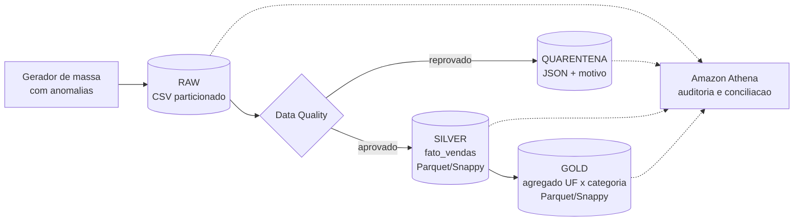
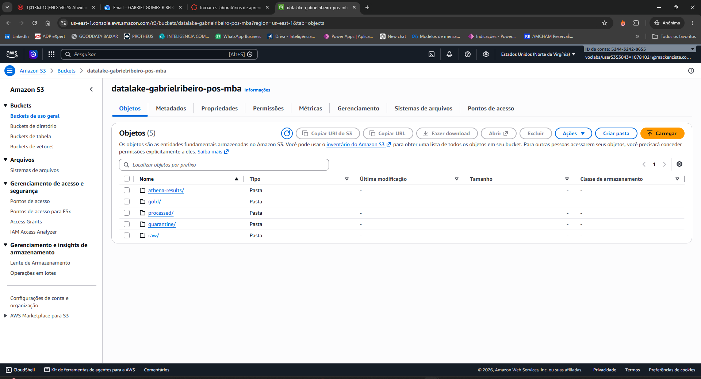
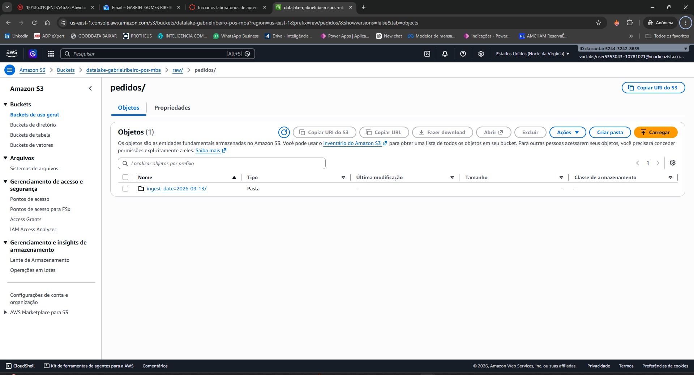
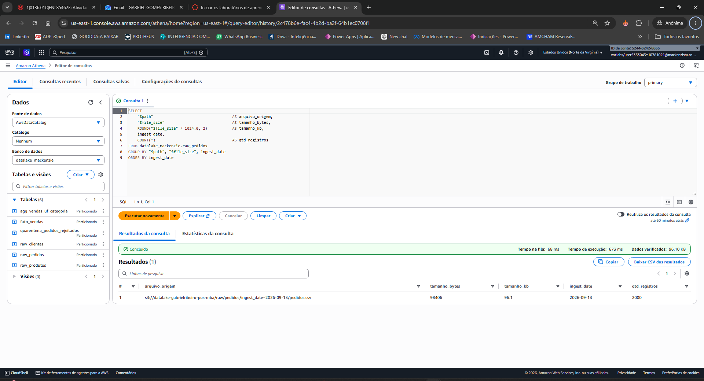
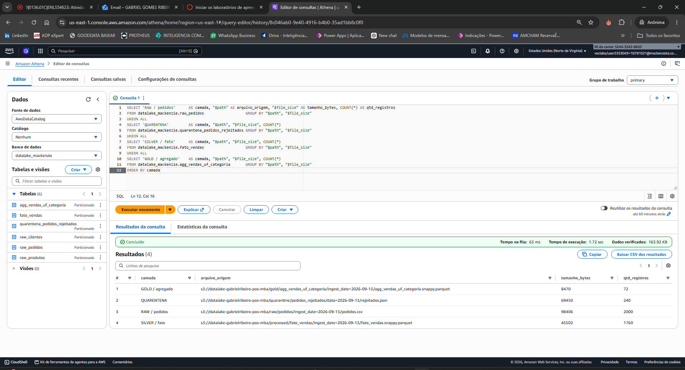
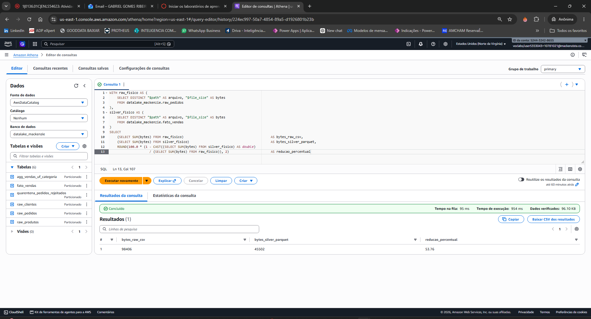
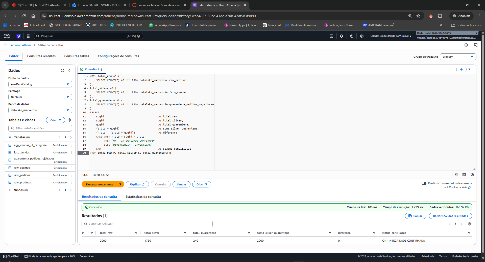
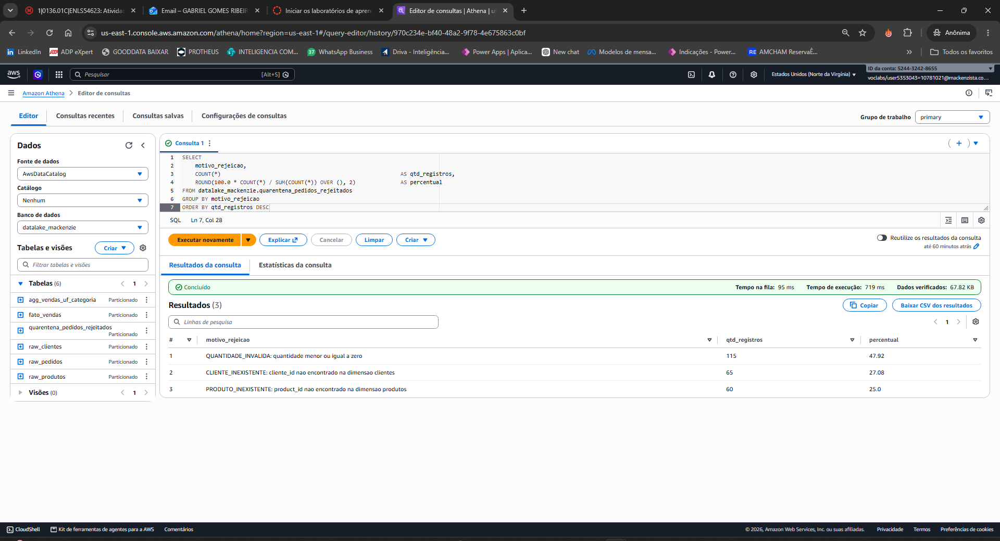
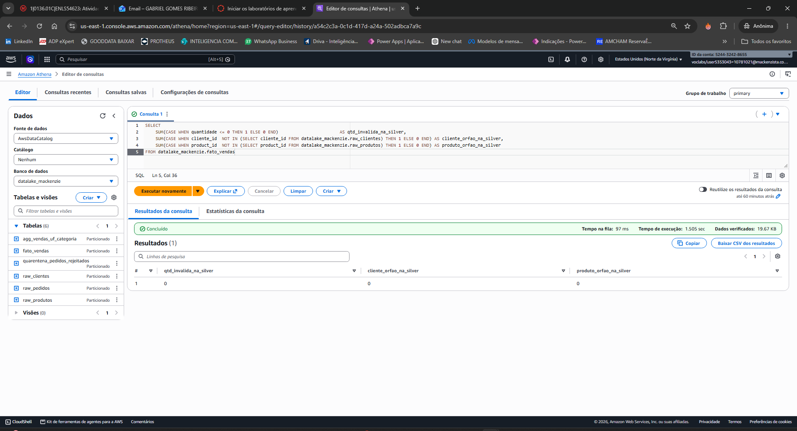
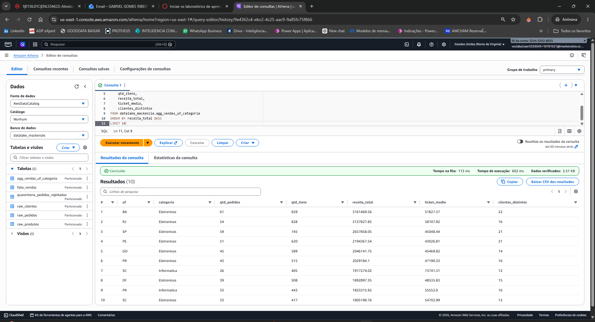

# Pipeline de Data Lake com Amazon S3 e Amazon Athena

**Atividade 2**: Construção de um pipeline completo de ingestão, Data Quality, quarentena de anomalias, transformação em camadas analíticas (Medallion Architecture) e auditoria de metadados.

| | |
|---|---|
| **Aluno** | Gabriel G. Ribeiro |
| **RA** | 10781021 |
| **Curso** | MBA em Inteligência de Dados & Analytics para Negócios |
| **Professor** | Yuri Menezes |
| **Serviços AWS** | Amazon S3, Amazon Athena (AWS Glue Data Catalog) |
| **Linguagem** | Python 3.10+ (pandas, pyarrow, boto3) |

---

## 1. O que este projeto faz

O pipeline simula o ciclo de vida de dados de vendas dentro de um data lake, do dado bruto ao dado pronto para análise:

1. **Gera uma massa de dados sintética** de clientes, produtos e pedidos, injetando **anomalias de propósito** (quantidades negativas, quantidades zeradas e pedidos apontando para clientes ou produtos que não existem).
2. **Grava na camada Raw** em CSV, particionado por data de ingestão no padrão Hive (`ingest_date=YYYY-MM-DD`).
3. **Aplica as regras de Data Quality** e separa o joio do trigo: o que passa segue para a camada Silver, o que falha vai para a **quarentena** em JSON, **com o motivo da rejeição registrado**.
4. **Constrói a camada Silver** (`fato_vendas`) com o enriquecimento via JOIN e o campo derivado `valor_total`, em Parquet com compressão Snappy.
5. **Constrói a camada Gold** (`agg_vendas_uf_categoria`) com a agregação analítica por UF e categoria e as métricas de negócio.
6. **Audita a integridade**, provando que `Raw = Silver + Quarentena`, ou seja, nenhum registro se perdeu no caminho.



---

## 2. Estrutura de pastas gerada no S3

```
s3://<seu-bucket>/
├── raw/                                      # camada bruta, dado como chegou (CSV)
│   ├── clientes/ingest_date=YYYY-MM-DD/clientes.csv
│   ├── produtos/ingest_date=YYYY-MM-DD/produtos.csv
│   └── pedidos/ingest_date=YYYY-MM-DD/pedidos.csv
├── quarantine/                               # registros reprovados (JSON + motivo)
│   └── pedidos_rejeitados/data=YYYY-MM-DD/rejeitados.json
├── processed/                                # camada Silver (Parquet/Snappy)
│   └── fato_vendas/ingest_date=YYYY-MM-DD/fato_vendas.snappy.parquet
├── gold/                                     # camada Gold (Parquet/Snappy)
│   └── agg_vendas_uf_categoria/ingest_date=YYYY-MM-DD/agg_vendas_uf_categoria.snappy.parquet
└── athena-results/                           # saída das queries do Athena
```

O particionamento Hive (`chave=valor` no nome da pasta) é o que permite ao Athena reconhecer `ingest_date` como coluna de partição e ler apenas as pastas necessárias, reduzindo custo e tempo de query.

---

## 3. Estrutura do repositório

```
.
├── run_pipeline.py                 # orquestrador: roda as 4 etapas em sequência
├── requirements.txt
├── .env.example                    # modelo de configuração (copie para .env)
├── src/
│   ├── config.py                   # configuração central (destino, bucket, datas, volumes)
│   ├── storage.py                  # abstração de gravação: local ou Amazon S3
│   ├── ingest_raw.py               # ETAPA 1 - geração da massa e camada Raw
│   ├── process_silver.py           # ETAPA 2 - Data Quality, quarentena e camada Silver
│   ├── build_gold.py               # ETAPA 3 - camada Gold
│   ├── audit.py                    # ETAPA 4 - conciliação Raw = Silver + Quarentena
│   └── athena_setup.py             # apoio - gera/executa os DDLs do Athena
├── sql/
│   ├── 01_create_database.sql
│   ├── 02_create_tables_raw.sql
│   ├── 03_create_tables_quarentena_silver_gold.sql
│   ├── 04_auditoria_metadados.sql       # queries com "$path" e "$file_size"
│   └── 05_conciliacao_integridade.sql   # query da conciliação
├── tests/
│   └── test_data_quality.py        # testes automatizados das regras de qualidade
├── docs/
│   ├── arquitetura.md              # decisões técnicas explicadas
│   ├── guia_prints_athena.md       # passo a passo das capturas de tela
│   ├── relatorio_execucao.json     # métricas da última execução
│   └── prints/                     # capturas de tela do console do Athena
└── data/datalake/                  # saída da execução em modo local (espelho do S3)
```

---

## 4. Pré-requisitos

- Python 3.10 ou superior
- Uma conta AWS com permissão para S3 e Athena (apenas para a execução na nuvem)
- Credenciais AWS disponíveis para o `boto3`, por um dos dois caminhos:
  - AWS CLI configurada (`aws configure`); ou
  - variáveis de ambiente na sessão do terminal (não precisa instalar o AWS CLI):

    ```powershell
    # PowerShell (Windows)
    $env:AWS_ACCESS_KEY_ID     = "SUA_ACCESS_KEY"
    $env:AWS_SECRET_ACCESS_KEY = "SUA_SECRET_KEY"
    $env:AWS_DEFAULT_REGION    = "us-east-1"
    ```

    ```bash
    # bash / Linux / macOS
    export AWS_ACCESS_KEY_ID="SUA_ACCESS_KEY"
    export AWS_SECRET_ACCESS_KEY="SUA_SECRET_KEY"
    export AWS_DEFAULT_REGION="us-east-1"
    ```

```bash
pip install -r requirements.txt
```

---

## 5. Como executar o pipeline

### 5.1 Modo local (sem AWS, para validar o pipeline)

Grava a mesma estrutura de pastas em `./data/datalake`. Serve para testar tudo sem gerar custo.

```bash
python run_pipeline.py
```

### 5.2 Modo AWS (gravando no Amazon S3)

**Passo 1: configurar as credenciais**

Use um dos caminhos da seção 4 (`aws configure` ou as variáveis de ambiente `AWS_ACCESS_KEY_ID`, `AWS_SECRET_ACCESS_KEY` e `AWS_DEFAULT_REGION`).

**Passo 2: definir o bucket**

```bash
cp .env.example .env
# edite o .env e ajuste:
#   DATALAKE_TARGET=s3
#   S3_BUCKET=seu-bucket-unico-aqui
#   AWS_REGION=us-east-1
```

**Passo 3: rodar o pipeline** (o parâmetro `--criar-bucket` cria o bucket caso ele ainda não exista)

```bash
python run_pipeline.py --target s3 --bucket seu-bucket-unico-aqui --criar-bucket
```

Saída esperada no terminal:

```
=== ETAPA 1 | INGESTAO RAW ===
clientes gravados :    200  -> s3://seu-bucket/raw/clientes/ingest_date=2026-09-13/clientes.csv
produtos gravados :     60  -> s3://seu-bucket/raw/produtos/ingest_date=2026-09-13/produtos.csv
pedidos gravados  :   2000  -> s3://seu-bucket/raw/pedidos/ingest_date=2026-09-13/pedidos.csv
anomalias injetadas de proposito:
  - quantidade_negativa   : 56
  - quantidade_zero       : 59
  - cliente_inexistente   : 65
  - produto_inexistente   : 60

=== ETAPA 2 | DATA QUALITY, QUARENTENA E SILVER ===
pedidos lidos da Raw :   2000
pedidos aprovados    :   1760
pedidos rejeitados   :    240
conciliacao: 2000 raw = 1760 silver + 240 quarentena -> OK

=== ETAPA 3 | CAMADA GOLD ===
linhas agregadas (uf x categoria): 72

=== ETAPA 4 | AUDITORIA E CONCILIACAO ===
status           : OK
```

### 5.3 Outras opções úteis

```bash
python run_pipeline.py --etapa raw                    # roda somente a ingestão
python run_pipeline.py --ingest-date 2026-09-10       # simula outra data de ingestão
python -m tests.test_data_quality                     # roda os testes das regras de qualidade
```

Rodar o pipeline com datas diferentes cria novas partições lado a lado, exatamente como uma carga diária real.

---

## 6. Regras de Data Quality aplicadas

| Regra | Validação | Ação |
|---|---|---|
| R1 | `quantidade` precisa ser numérica | rejeita e envia para quarentena |
| R2 | `quantidade` maior que zero | rejeita e envia para quarentena |
| R3 | `cliente_id` deve existir na dimensão `clientes` | rejeita e envia para quarentena |
| R4 | `product_id` deve existir na dimensão `produtos` | rejeita e envia para quarentena |

Um mesmo pedido pode violar mais de uma regra. Nesse caso ele aparece **uma única vez** na quarentena, com todos os motivos concatenados no campo `motivo_rejeicao` e a contagem em `qtd_regras_violadas`. Isso é o que garante que a conciliação `Raw = Silver + Quarentena` feche exatamente.

Exemplo de registro na quarentena:

```json
{"pedido_id": "PED000016", "cliente_id": "C00178", "product_id": "P91715", "quantidade": 20, "data_pedido": "2026-09-08", "canal_venda": "E-commerce", "motivo_rejeicao": "PRODUTO_INEXISTENTE: product_id nao encontrado na dimensao produtos", "qtd_regras_violadas": 1, "ingest_date": "2026-09-13"}
```

O arquivo usa o formato **JSON Lines** (um objeto JSON por linha), que é o formato lido nativamente pelo Athena com o JSON SerDe.

---

## 7. Consultas no Amazon Athena

**Passo 1: definir o local de resultado**
No console do Athena: *Settings → Manage → Query result location* → `s3://<seu-bucket>/athena-results/`

**Passo 2: gerar os scripts já com o nome do seu bucket**

```bash
python -m src.athena_setup --bucket seu-bucket-unico-aqui
# arquivos prontos em sql/generated/
```

**Passo 3: executar na ordem**

| Arquivo | O que faz |
|---|---|
| `01_create_database.sql` | cria o banco `datalake_mackenzie` no Glue Data Catalog |
| `02_create_tables_raw.sql` | cria as tabelas externas da Raw e descobre as partições (`MSCK REPAIR TABLE`) |
| `03_create_tables_quarentena_silver_gold.sql` | cria as tabelas da quarentena, Silver e Gold |
| `04_auditoria_metadados.sql` | auditoria com as pseudo-colunas `"$path"` e `"$file_size"` |
| `05_conciliacao_integridade.sql` | conciliação `Raw = Silver + Quarentena` |

Opcionalmente, os DDLs (01 a 03) podem ser executados automaticamente:

```bash
python -m src.athena_setup --bucket seu-bucket-unico-aqui --executar
```

As queries de auditoria (04 e 05) devem ser rodadas **no console**, porque o enunciado pede as capturas de tela.

---

## 8. Capturas de tela obrigatórias

As imagens ficam em [`docs/prints/`](docs/prints/). O passo a passo detalhado de cada captura está em [`docs/guia_prints_athena.md`](docs/guia_prints_athena.md).

| # | Print | Comprova |
|---|---|---|
| 1 | Estrutura de pastas no console do S3 | particionamento Hive nas quatro camadas |
| 2 | Query `Q4.1` com `"$path"` e `"$file_size"` | rastreabilidade até o arquivo físico |
| 3 | Query `Q4.2` (inventário das quatro camadas) | metadados de todas as camadas |
| 4 | Query `Q5.1` (conciliação) | `Raw = Silver + Quarentena` |
| 5 | Query `Q5.2` (rejeições por motivo) | efetividade das regras de Data Quality |
| 6 | Query `Q5.5` (leitura da Gold) | agregação analítica por UF e categoria |

### 8.1 Estrutura de pastas no S3 (particionamento Hive)



Partição Hive `ingest_date=YYYY-MM-DD` dentro de `raw/pedidos/`:



### 8.2 Metadados com `"$path"` e `"$file_size"` (query Q4.1)



### 8.3 Inventário físico das quatro camadas (query Q4.2)



Ganho de compressão do CSV da Raw para o Parquet/Snappy da Silver (query Q4.3):



### 8.4 Conciliação de integridade `Raw = Silver + Quarentena` (query Q5.1)



### 8.5 Rejeições por motivo (query Q5.2)



Prova de que nenhuma anomalia vazou para a Silver (query Q5.3, resultado esperado zero em todas as colunas):



### 8.6 Leitura analítica da camada Gold (query Q5.5)



---

## 9. Resultado da última execução

Números da execução registrada em [`docs/relatorio_execucao.json`](docs/relatorio_execucao.json):

| Métrica | Valor |
|---|---|
| Pedidos gerados na Raw | 2.000 |
| Pedidos aprovados (Silver) | 1.760 |
| Pedidos em quarentena | 240 |
| Rejeições por quantidade inválida | 115 |
| Rejeições por cliente inexistente | 65 |
| Rejeições por produto inexistente | 60 |
| Linhas na camada Gold (UF × categoria) | 72 |
| Conciliação `Raw = Silver + Quarentena` | **OK** (diferença = 0) |

> A soma por motivo (115 + 65 + 60 = 240) bate com o total da quarentena porque, nesta execução, nenhum pedido violou duas regras ao mesmo tempo. O pipeline trata esse caso: se acontecer, o registro aparece uma única vez com os dois motivos.

---

## 10. Onde cada critério de avaliação é atendido

| Critério | Peso | Onde está no projeto |
|---|---|---|
| Ingestão e particionamento no S3 | 20% | `src/ingest_raw.py`: massa com anomalias controladas, CSV e partição `ingest_date=YYYY-MM-DD` |
| Data Quality e quarentena | 25% | `src/process_silver.py`: regras R1 a R4 e JSON de rejeitados com motivo; testes em `tests/test_data_quality.py` |
| Camadas Silver e Gold | 30% | `src/process_silver.py` (JOIN + `valor_total` + Parquet/Snappy) e `src/build_gold.py` (agregação por UF e categoria) |
| Auditoria e validação no Athena | 25% | `sql/02` e `sql/03` (tabelas externas), `sql/04` (`"$path"`, `"$file_size"`), `sql/05` (conciliação) |
